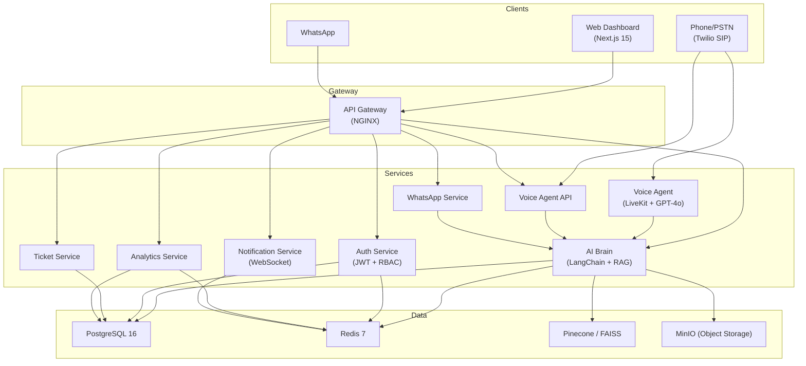

<div align="center">

# 🎙️ VoiceAI — Enterprise AI Voice Support Platform

**Production-ready AI voice customer support system with real-time conversations, intelligent routing, and advanced analytics.**

[](https://github.com/voiceai/platform/actions)
[](LICENSE)

</div>

---

## Architecture



## Features

| Feature | Description |
|---------|-------------|
| 🎤 **Voice AI Agent** | Real-time voice pipeline: Deepgram STT → GPT-4o → Cartesia TTS |
| 📞 **Voice Agent API** | Inbound/outbound calling via Twilio with AI orchestration |
| 💬 **WhatsApp Service**| Intelligent messaging and conversational AI over WhatsApp |
| 🧠 **RAG Knowledge Base** | Hybrid retrieval (vector + keyword) with reranking |
| 🗄️ **MinIO Object Storage**| S3-compatible scalable storage for audio and documents |
| 📊 **Live Analytics** | Real-time dashboards with sentiment tracking and SLA monitoring |
| 🎫 **Ticket Management** | Full lifecycle with auto-escalation and priority scoring |
| 🔐 **Enterprise Security** | Multi-tenant isolation, RBAC, JWT auth, PII redaction |
| 🔄 **Auto-Escalation** | Intelligent handoff based on sentiment and confidence thresholds |
| 🌐 **Multi-Channel** | Phone (Twilio SIP), WhatsApp, Web Chat, SMS |
| 📡 **Real-time Events** | WebSocket hub with Redis Pub/Sub for cross-instance broadcasting |
| 📈 **Observability** | Prometheus metrics + Grafana dashboards |

## Quick Start

```bash
# 1. Clone and configure
git clone https://github.com/voiceai/platform.git
cd ai_agent
cp .env.example .env
# Edit .env with your API keys (OPENAI_API_KEY, DEEPGRAM_API_KEY, etc.)

# 2. Start everything
make up

# 3. Open the dashboard
open http://localhost:3000
# Login: admin@voiceai.demo / admin123
```

## Service Ports

| Service | Port | URL |
|---------|------|-----|
| API Gateway (NGINX) | 8080 | `http://localhost:8080` |
| AI Brain | 8001 | `http://localhost:8001` |
| Auth Service | 8002 | `http://localhost:8002` |
| Ticket Service | 8003 | `http://localhost:8003` |
| Analytics Service | 8004 | `http://localhost:8004` |
| Notification Service | 8005 | `http://localhost:8005` |
| Voice Agent API | 8006 | `http://localhost:8006` |
| WhatsApp Service | 8007 | `http://localhost:8007` |
| Voice Agent (LiveKit) | 8000 | `http://localhost:8000` |
| Dashboard (Next.js) | 3000 | `http://localhost:3000` |
| PostgreSQL | 5432 | — |
| Redis | 6379 | — |
| MinIO | 9001 | `http://localhost:9001` |
| Prometheus | 9090 | `http://localhost:9090` |
| Grafana | 3001 | `http://localhost:3001` (admin / voiceai_grafana) |

## Project Structure

```
ai_agent/
├── services/
│   ├── api-gateway/           # NGINX reverse proxy + rate limiting
│   ├── voice-agent/           # LiveKit voice pipeline (STT→LLM→TTS)
│   ├── voice-agent-api/       # Twilio integration and API control
│   ├── whatsapp-service/      # WhatsApp Meta Webhook processing
│   ├── ai-brain/              # LangChain RAG + LLM orchestration
│   ├── auth-service/          # JWT auth + RBAC + API keys
│   ├── ticket-service/        # Support ticket lifecycle
│   ├── analytics-service/     # Metrics + chart-ready data
│   └── notification-service/  # WebSocket hub + Redis Pub/Sub
│
├── frontend/
│   └── dashboard/             # Next.js 15 admin dashboard
│
├── shared/
│   ├── schemas/models.py      # Shared Pydantic models
│   ├── utils/database.py      # Async DB + Redis connections
│   ├── utils/logging.py       # Structured logging
│   ├── utils/security.py      # PII redaction + API key management
│   ├── utils/audit.py         # Audit log helper
│   └── migrations/            # PostgreSQL DDL (14 tables)
│
├── knowledge-base/            # FAQ + policy docs for RAG ingestion
├── infra/
│   ├── docker/                # Dockerfiles (7 services)
│   ├── k8s/                   # Kubernetes manifests + Prometheus
│   ├── grafana/               # Dashboard JSON + provisioning
│   └── scripts/               # Setup and deployment scripts
│
├── tests/
│   ├── unit/                  # pytest unit tests per service
│   ├── integration/           # Multi-service flow tests
│   └── load/                  # Locust performance tests
│
├── .github/workflows/         # CI/CD + security scanning
├── docker-compose.yml         # Local dev environment
├── Makefile                   # Common commands
└── .env.example               # Environment variable template
```

## API Reference

### Auth Service (`/api/v1/auth/`)

| Method | Endpoint | Description |
|--------|----------|-------------|
| POST | `/register` | Create new user |
| POST | `/login` | Login → JWT tokens |
| POST | `/refresh` | Refresh access token |
| GET | `/me` | Current user profile |
| PUT | `/me` | Update profile |
| GET | `/users` | List users (admin) |
| POST | `/api-keys` | Generate API key (admin) |
| GET | `/api-keys` | List API keys |
| DELETE | `/api-keys/{id}` | Revoke API key |

### AI Brain (`/api/v1/ai/`)

| Method | Endpoint | Description |
|--------|----------|-------------|
| POST | `/chat` | AI response generation |
| POST | `/classify-intent` | Intent classification |
| POST | `/analyze-sentiment` | Sentiment analysis |
| POST | `/search-knowledge` | RAG knowledge search |
| POST | `/summarize` | Conversation summary |

### Conversations (`/api/v1/conversations/`)

| Method | Endpoint | Description |
|--------|----------|-------------|
| POST | `/` | Create conversation |
| GET | `/` | List conversations |
| GET | `/{id}` | Get conversation detail |
| PATCH | `/{id}` | Update conversation |
| POST | `/{id}/messages` | Add message |

### Tickets (`/api/v1/tickets/`)

| Method | Endpoint | Description |
|--------|----------|-------------|
| POST | `/` | Create ticket |
| GET | `/` | List tickets (paginated) |
| GET | `/stats` | Ticket statistics |
| GET | `/{id}` | Get ticket detail |
| PATCH | `/{id}` | Update ticket |
| DELETE | `/{id}` | Delete ticket (admin) |
| GET | `/{id}/activity` | Activity log |
| POST | `/{id}/escalate` | Escalate ticket |

### Analytics (`/api/v1/analytics/`)

| Method | Endpoint | Description |
|--------|----------|-------------|
| GET | `/dashboard` | Real-time dashboard metrics |
| GET | `/conversations` | Conversation analytics |
| GET | `/sentiment` | Sentiment trends |
| GET | `/agents` | Agent performance |
| GET | `/intents` | Intent distribution |
| GET | `/sla` | SLA compliance |
| POST | `/events` | Record event |
| GET | `/export` | CSV export |

### Notifications (`/api/v1/notifications/`)

| Method | Endpoint | Description |
|--------|----------|-------------|
| WS | `/ws/{org_id}` | WebSocket (real-time events) |
| POST | `/broadcast` | Broadcast to org |
| POST | `/send` | Send to user |
| GET | `/connections` | List connections |

## Environment Variables

| Variable | Required | Default | Description |
|----------|----------|---------|-------------|
| `DATABASE_URL` | ✅ | (local) | PostgreSQL connection string |
| `REDIS_URL` | ✅ | (local) | Redis connection string |
| `JWT_SECRET_KEY` | ✅ | — | JWT signing secret |
| `OPENAI_API_KEY` | ✅ | — | OpenAI API key (GPT-4o) |
| `DEEPGRAM_API_KEY` | ✅ | — | Deepgram STT key |
| `CARTESIA_API_KEY` | ✅ | — | Cartesia TTS key |
| `LIVEKIT_URL` | ✅ | — | LiveKit server URL |
| `LIVEKIT_API_KEY` | ✅ | — | LiveKit API key |
| `LIVEKIT_API_SECRET` | ✅ | — | LiveKit API secret |
| `MINIO_ACCESS_KEY` | ✅ | — | MinIO access key |
| `MINIO_SECRET_KEY` | ✅ | — | MinIO secret key |
| `PINECONE_API_KEY` | ❌ | — | Pinecone key (falls back to FAISS) |
| `TWILIO_ACCOUNT_SID` | ❌ | — | Twilio SID (for phone) |
| `TWILIO_AUTH_TOKEN` | ❌ | — | Twilio token |
| `WHATSAPP_API_TOKEN` | ❌ | — | WhatsApp Meta Cloud API token |
| `WHATSAPP_WEBHOOK_VERIFY_TOKEN` | ❌ | — | Token for WhatsApp webhook |

## Development

```bash
# Start only infrastructure (DB + Redis)
docker compose up -d postgres redis

# Run a single service locally
cd services/auth-service && uvicorn main:app --reload --port 8002

# Run frontend dev server
cd frontend/dashboard && npm run dev

# Run tests
make test

# Run load tests
make test-load

# Lint
make lint
make lint-fix

# Ingest knowledge base into vector DB
make ingest-kb
```

## Deployment

### Docker Compose (Production)
```bash
make build
make up
```

### Kubernetes
```bash
# Staging deployment
kustomize build infra/k8s/overlays/staging | kubectl apply -f -

# Production deployment
kustomize build infra/k8s/overlays/production | kubectl apply -f -
```

Manifests are managed using Kustomize and include Deployments, Services, HPAs, Ingress with TLS, ConfigMaps, and Secrets. Continuous Deployment is configured via GitHub Actions.

## Monitoring

- **Prometheus**: `http://localhost:9090` — Metrics collection
- **Grafana**: `http://localhost:3001` — Pre-configured dashboards
  - VoiceAI Overview: Call volume, error rates, latency
  - Voice Pipeline: STT/LLM/TTS latency breakdown

## Contributing

1. Create a feature branch from `develop`
2. Write tests for new functionality
3. Ensure `make lint` and `make test` pass
4. Submit a PR to `develop`
5. After review, merge to `main` triggers deployment

## License

MIT License — see [LICENSE](LICENSE) for details.
